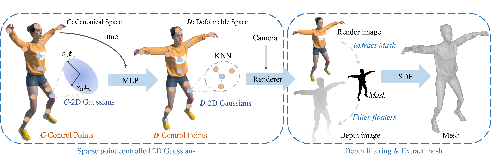
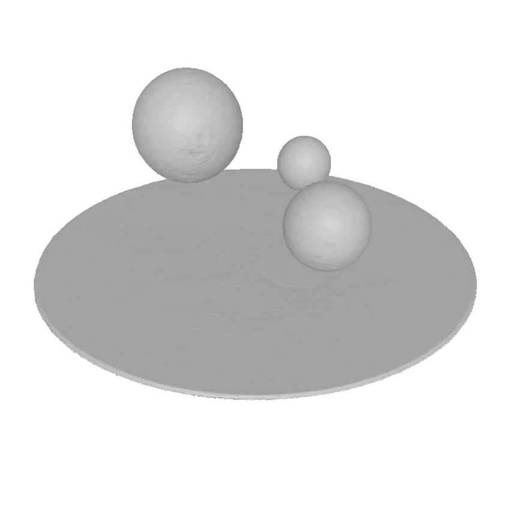
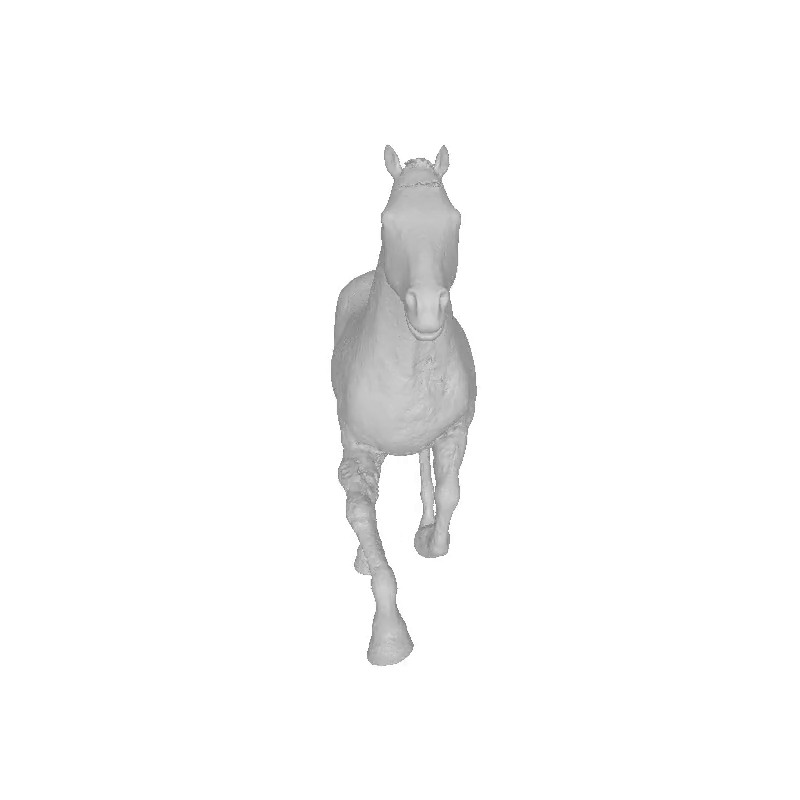
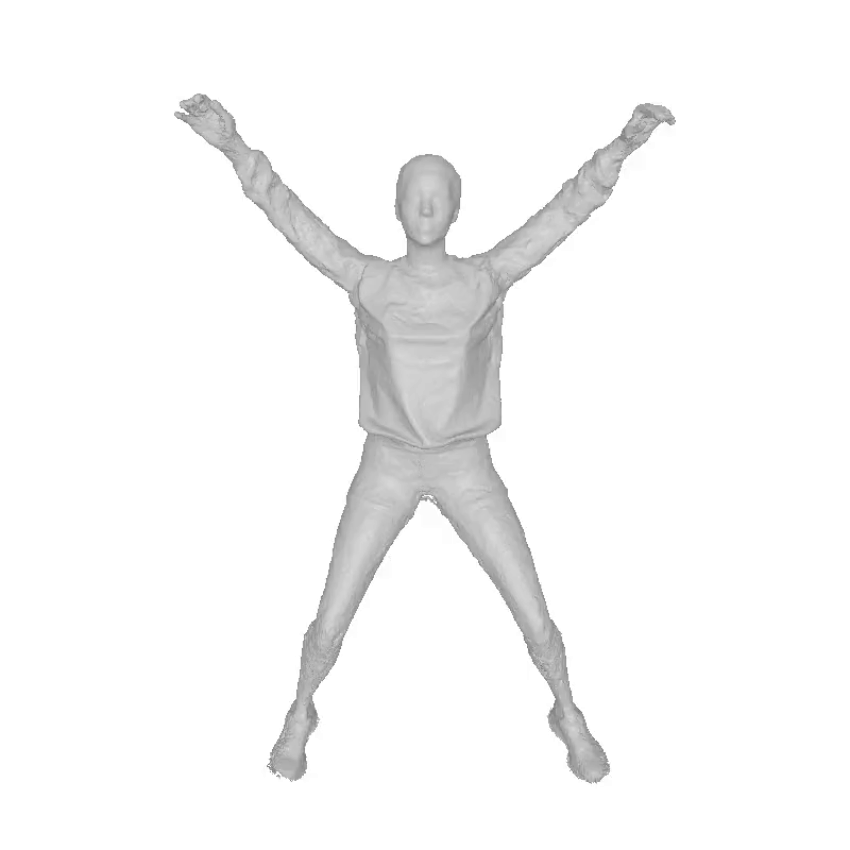
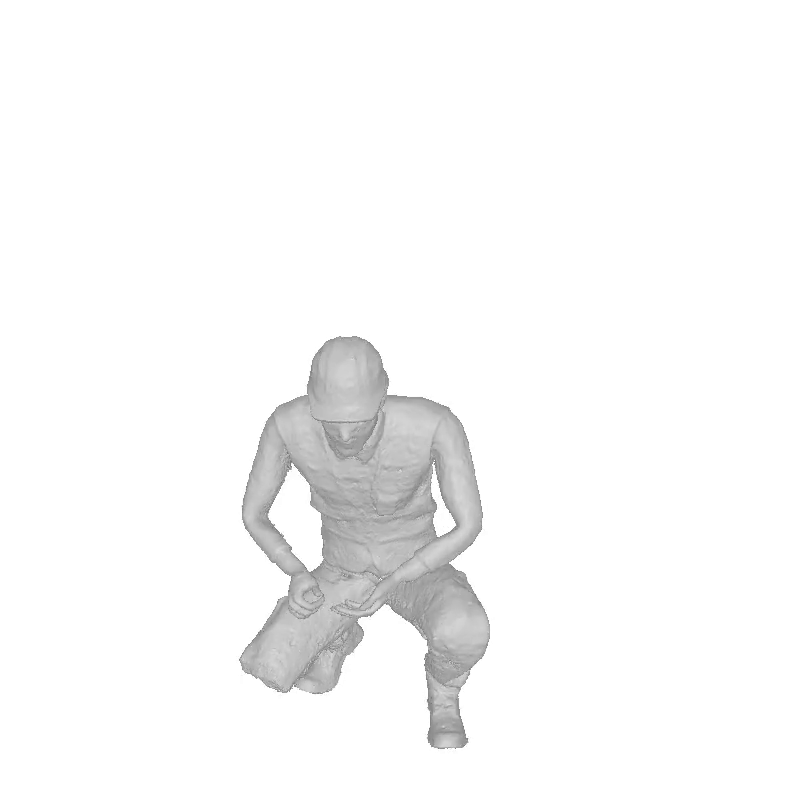
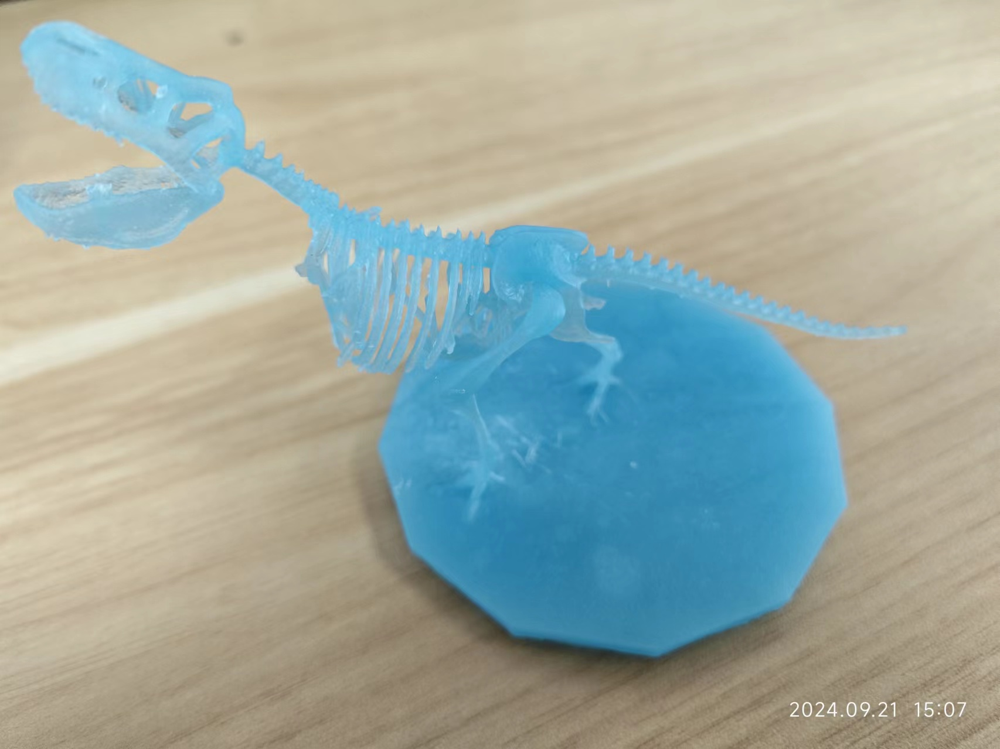

<div align="center">
<h1 align="center">
  Dynamic 2D Gaussians: Geometrically accurate radiance fields for dynamic objects
</h1>

### [arXiv Paper](https://arxiv.org/abs/2403.19586)

[Shuai Zhang](https://github.com/Shuaizhang7) <sup>1\*</sup>, [Guanjun Wu](https://guanjunwu.github.io/) <sup>2\*</sup>,[Xinggang Wang](https://xwcv.github.io/) <sup>1</sup>,[Bin Feng]() <sup>1</sup>,
[Wenyu Liu](http://eic.hust.edu.cn/professor/liuwenyu) <sup>1,📧</sup>

<sup>1</sup> School of Electronic Information and Communications, Huazhong University of Science and Technology \
<sup>2</sup>  School of Computer Science & Technology, Huazhong University of Science and Technology 

(\* Equal contributions.📧 Corresponding author) 

</div>

---

## Abstract
<div align="center">
  
</div>

*Framework of our D-2DGS. Sparse points are bonded with canonical 2D Gaussians. Deformation networks are used to predict each sparse control point's control signals given any timestamp. The image and depth are rendered by deformed 2D Gaussians with alpha blending. To get high-quality meshes, depth images are filtered by rendered images with RGB mask, and then TSDF is applied on multiview depth images and RGB images.*

## Demo

<div align="center">
  
  
  
  

</div>

## Updates

- 2024-09-20: Upload code


## Installation

```bash
git clone --recursive git@github.com:hustvl/Dynamic-2DGS.git
cd Dynamic-2DGS
conda create --name dynamic-2dgs python=3.8.0
conda activate dynamic-2dgs

pip install torch==2.1.0 torchvision==0.16.0 torchaudio==2.1.0 --index-url https://download.pytorch.org/whl/cu121

pip install ./submodules/diff-surfel-rasterization
pip install ./submodules/simple-knn
pip install git+https://github.com/NVlabs/nvdiffrast/
pip install "git+https://github.com/facebookresearch/pytorch3d.git"

pip install -r requirements.txt
```

## Data
We use the following dataset:
* [D-NeRF](https://www.albertpumarola.com/research/D-NeRF/index.html): dynamic scenes of synthetic objects ([download](https://www.dropbox.com/s/0bf6fl0ye2vz3vr/data.zip?e=1&dl=0))
* [DG-Mesh](https://github.com/Isabella98Liu/DG-Mesh?tab=readme-ov-file): dynamic scenes of synthetic objects ([download](https://drive.google.com/file/d/1yBga2DsIKG6zQK9V2WextewvhaV8Xho3/view))

## Run

### Training

```bash
CUDA_VISIBLE_DEVICES=0 python train_gui.py --source_path YOUR/PATH/TO/DATASET/jumpingjacks --model_path outputs/jumpingjacks --deform_type node  --is_blender --eval --gt_alpha_mask_as_scene_mask --local_frame --resolution 1 --W 800 --H 800
```

### Evalualuation

```bash
CUDA_VISIBLE_DEVICES=0 python render_mesh.py --source_path YOUR/PATH/TO/DATASET/jumpingjacks --model_path outputs/jumpingjacks --deform_type node --hyper_dim 8 --is_blender --eval --local_frame --resolution 1
```

### 3D Printing
Reconstruct the mesh through our model and 3D print it:
<div align="center">
  
</div>

## Citation
If you find our work useful, please consider citing:
```BibTeX

```

## Acknowledgement

* Our work is developed on the basis of [DG-Mesh](https://github.com/Isabella98Liu/DG-Mesh), [SCGS](https://github.com/yihua7/SC-GS) and [2DGS](https://github.com/hbb1/2d-gaussian-splatting/tree/main), thanks to these great works.

```
@misc{liu2024dynamic,
 title={Dynamic Gaussians Mesh: Consistent Mesh Reconstruction from Monocular Videos}, 
 author={Isabella Liu and Hao Su and Xiaolong Wang},
 year={2024},
 eprint={2404.12379},
 archivePrefix={arXiv},
 primaryClass={cs.CV}
}

@article{huang2023sc,
  title={SC-GS: Sparse-Controlled Gaussian Splatting for Editable Dynamic Scenes},
  author={Huang, Yi-Hua and Sun, Yang-Tian and Yang, Ziyi and Lyu, Xiaoyang and Cao, Yan-Pei and Qi, Xiaojuan},
  journal={arXiv preprint arXiv:2312.14937},
  year={2023}
}

@inproceedings{Huang2DGS2024,
    title={2D Gaussian Splatting for Geometrically Accurate Radiance Fields},
    author={Huang, Binbin and Yu, Zehao and Chen, Anpei and Geiger, Andreas and Gao, Shenghua},
    publisher = {Association for Computing Machinery},
    booktitle = {SIGGRAPH 2024 Conference Papers},
    year      = {2024},
    doi       = {10.1145/3641519.3657428}
}
```


